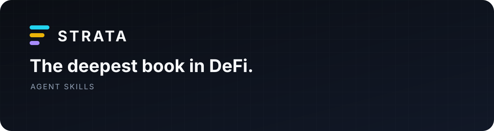

<p align="center">
  
</p>

<h1 align="center">Strata Agent Skills</h1>

<p align="center">
  Install Strata judgment—not just Strata syntax—into your coding agent.
</p>

<p align="center">
  <a href="https://stratabook.app/docs/hello-agents">Documentation</a>
  ·
  <a href="https://github.com/alsk1992/strata-mcp">MCP</a>
  ·
  <a href="https://github.com/alsk1992/strata-sdk-ts">TypeScript</a>
  ·
  <a href="https://stratabook.app">Strata</a>
</p>

The Strata skill teaches coding agents how to discover markets, request Sonar
quotes, preserve exact token amounts, and choose the right interface for the
job. It is portable across Codex, Claude Code, Cursor, OpenCode, and other tools
that support the open Agent Skills format.

## Install in one command

Install into the current project:

```sh
npx skills add alsk1992/strata-agent-skills --skill strata
```

Or install it globally for your detected coding agents:

```sh
npx skills add alsk1992/strata-agent-skills --skill strata --global
```

The installer discovers supported agents and places the skill in their expected
location.

## Skill plus MCP

The skill gives an agent the Strata playbook. MCP gives it the live connection.
For the complete experience, use both:

```json
{
  "mcpServers": {
    "strata": {
      "type": "streamable-http",
      "url": "https://api.stratabook.app/mcp"
    }
  }
}
```

No MCP support? The same skill can drive the TypeScript CLI:

```sh
npx -y @stratabook/sdk markets --json
npx -y @stratabook/sdk quote \
  --market SOL/USDC \
  --side sell \
  --amount-atoms 10000000 \
  --json
```

## What changes after installation

| When the task is… | The agent knows to… |
| --- | --- |
| Find a market | Discover current availability instead of guessing |
| Quote a trade | Resolve market, side, atomic amount, and slippage before calling Sonar |
| Explain the result | Report consumed input, output, fees, minimum output, impact, and expiry |
| Handle a human amount | Confirm token decimals before converting to atomic units |
| Reuse an old quote | Stop at expiry and request a fresh result |
| Write integration code | Choose MCP, terminal, TypeScript, or Rust for the actual job |

The result is less prompt engineering and fewer silent financial assumptions.

## One skill, every Strata surface

| Surface | The skill uses it for |
| --- | --- |
| [Strata MCP](https://github.com/alsk1992/strata-mcp) | Interactive agent access to live markets and Sonar |
| [TypeScript SDK](https://github.com/alsk1992/strata-sdk-ts) | Applications, browser code, scripts, and the `strata` CLI |
| [Rust SDK](https://github.com/alsk1992/strata-sdk-rs) | Native services and the `strata-agent` CLI |
| [Strata documentation](https://stratabook.app/docs/hello-agents) | Product concepts and supported workflows |

## What gets installed

```text
skills/strata/
├── SKILL.md
├── agents/
│   └── openai.yaml
└── references/
    └── public-contract.md
```

`SKILL.md` stays concise so the default agent context remains useful. Exact
field semantics, commands, and failure handling load only when the task needs
them.

<details>
<summary><strong>Manual installation</strong></summary>

Clone the repository:

```sh
git clone https://github.com/alsk1992/strata-agent-skills.git
cd strata-agent-skills
```

For Codex:

```sh
mkdir -p ~/.codex/skills
cp -R skills/strata ~/.codex/skills/strata
```

For Claude Code:

```sh
mkdir -p ~/.claude/skills
cp -R skills/strata ~/.claude/skills/strata
```

For a project-scoped installation, copy the directory into the corresponding
project skills folder instead.

</details>

## Current release

The skill covers market discovery and read-only Sonar quotes. It will not ask
for wallet or private-key material and will not claim a quote was submitted as
a transaction.

## Resources

- [Agent quick start](https://stratabook.app/docs/hello-agents)
- [Strata MCP](https://github.com/alsk1992/strata-mcp)
- [Issues and feature requests](https://github.com/alsk1992/strata-agent-skills/issues)
- [Security policy](SECURITY.md)

Licensed under either [Apache-2.0](LICENSE-APACHE) or [MIT](LICENSE-MIT).
